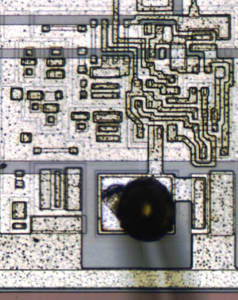
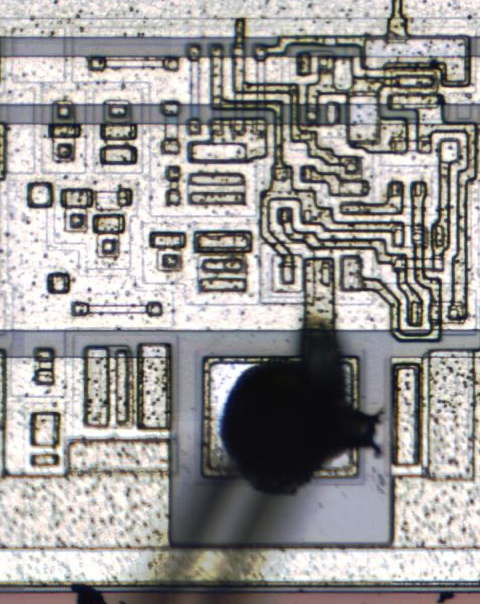
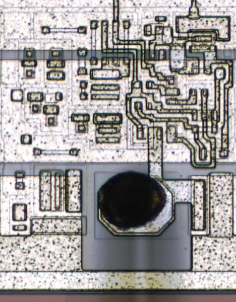
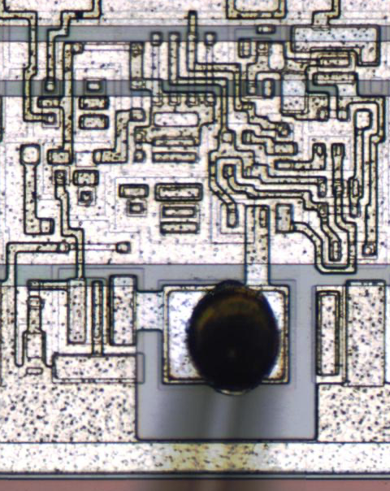
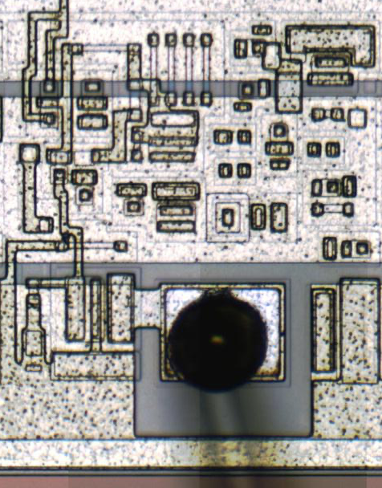
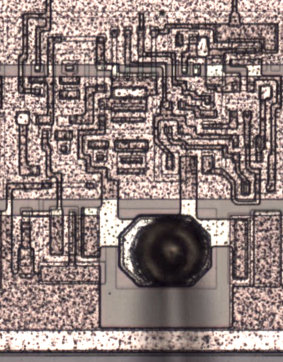
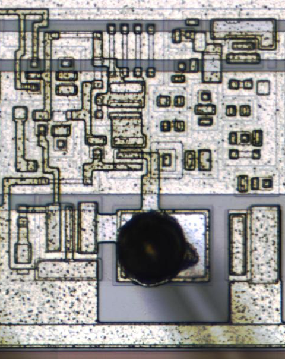
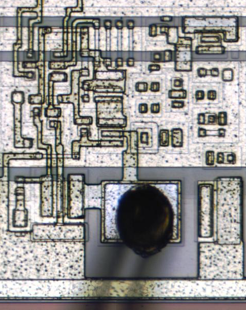

# DC600 Gate array details

## General description
### Technology
- Technology: Low power Bipolar Schottky
- Die size: .215 inch x .244 inch
- Max TDP per chip: 2 Watts
- Logic IO voltage: +5 Volts
- Core voltage: +2.5 Volts
### Package:
- Package size: 1.44 sq Inch (2.4 inches x 0.6 inches)
- Pin/pad count: 48
### Internals
- IO Cells per die: 44 I/O transceiver gates
- Logic gates per die: 400 identical 4 input NAND gates
- Delay per gate : 4 - 10 ns

## IO Cells

The EK-GA750-RM lists

| GATE TYPE | Description          | Output           | Drive low | Drive high | Control | Pull up? | Input  | Receiver | Diode? | Unk wire? | Picture |
|-----------|----------------------|------------------|-----------|------------|---------|----------|--------|----------|--------|-----------|---------|
| GA1TNF    | Input                | N None           | No        | No         | ---     | No       | F ?    | Yes      | Yes    | Yes       | DC608   |
| GA1TNG    | Input                | N None           | No        | No         | ---     | No       | G ?    | Yes      | No     | Yes       | DC608   |
| GA1TNH    | Input                | N None           | No        | No         | ---     | No       | H ?    | Yes      | Yes    | No        | DC608   |
| GA1TPF    | Bidir open collector | P OC Pullup?     | Yes       | No         | No      | Yes      | F ?    | Yes      | Yes    | Yes       | DC610   |
| GA1TCF    | Bidir open collector | C Open Collector | Yes       | No         | No      | No       | F ?    | Yes      | Yes    | Yes       | DC608   |
| GA1TCG    | Bidir open collector | C Open Collector | Yes       | No         | No      | No       | G ?    | Yes      | No     | Yes       | DC608   |
| GA1TCN    | Driver-OC            | C Open Collector | Yes       | No         | No      | No       | N None | No       | No     | ---       | DC608   |
| GA1TCI    | Driver-OC            | C Open Collector | Yes       | No         | No      | No       | I ?    | Yes      | No     | No        | DC608   |
| GA1TTN    | Totem pole output    | T Totem pole     | Yes       | Yes        | No      |          | N None | No       | No     | ---       | DC608   |
| GA1TTG    | Totem pole output    | T Totem pole     | Yes       | Yes        | No      | No       | G ?    | Yes      | No     | Yes       | DC608   |
| GA1TTI    | Totem pole output    | T Totem pole     |           |            |         |          | I ?    |          |        |           |         |
| GA1TZF    | Tri state bidir      | Z Tri state      | Yes       | Yes        | Yes     | No       | F ?    | Yes      | Yes    | Yes       | DC610   |
| GA1TZG    |                      | Z Tri state      | Yes       | Yes        | Yes     | No       | G ?    | Yes      | No     | Yes       | DC615   |
| GA1TZI    | Tri state output     | Z Tri state      |           |            |         |          | I ?    |          |        |           |         |
| GA1TZN    | Tri state output     | Z Tri state      | Yes       | Yes        | Yes     | No       | N None | No       | No     | ---       | DC608   |

As such, the naming scheme seems to be GA1T<driver><receiver>

 | GATE TYPE | Output           | Drive low | Drive high | Control | Pull up? |
 |-----------|------------------|-----------|------------|---------|----------|
 | GA1TN?    | N None           | No        | No         | ---     | No       |
 | GA1TP?    | P OC Pullup?     | Yes       | No         | No      | Yes      |
 | GA1TC?    | C Open Collector | Yes       | No         | No      | No       |
 | GA1TT?    | T Totem pole     | Yes       | Yes        | No      | No       |
 | GA1TZ?    | Z Tri state      | Yes       | Yes        | Yes     | No       |

 | GATE TYPE | Input  | Receiver | Diode? | Unk wire? |
 |-----------|--------|----------|--------|-----------|
 | GA1T?N    | N None | No       | No     | ---       |
 | GA1T?F    | F ?    | Yes      | Yes    | Yes       |
 | GA1T?G    | G ?    | Yes      | No     | Yes       |
 | GA1T?H    | H ?    | Yes      | Yes    | No        |
 | GA1T?I    | I ?    | Yes      | No     | No        |

### Die shots
#### Pure inputs
| GA1TNF                    | GA1TNG                    | GA1TNH                    | GA1TCI (not pure)         |
|---------------------------|---------------------------|---------------------------|---------------------------|
|  |  |  |  |

#### Pure outputs
| GA1TCN                    | GA1TPF (not pure)         | GA1TTN                    | GA1TZN                    |
|---------------------------|---------------------------|---------------------------|---------------------------|
|  |  |  |  |

## Soviet clone

The Soviet K1827XM gate array is a direct clone of the DC600.

## Further documents

* MP-XXX [sic]     - Field Service 11/750 Gate Array Print Set
* A-PS-1900003-GS  - General purpose specificiation for A 400 Internal Gate, Low-Power Schottky Type, Gate Array Integrated Circuit DC600 Series
* [Soviet gate array manual](https://www.1801bm1.com/files/retro/BOOK/Мальцев%20П.П.%20Базовые%20матричные%20кристаллы%20и%20матричные%20БИС.pdf) 